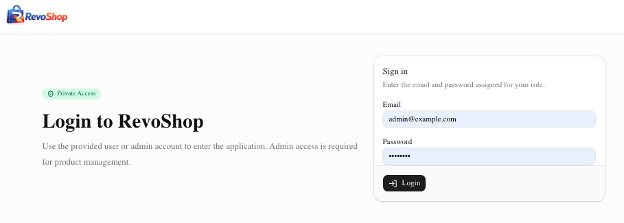
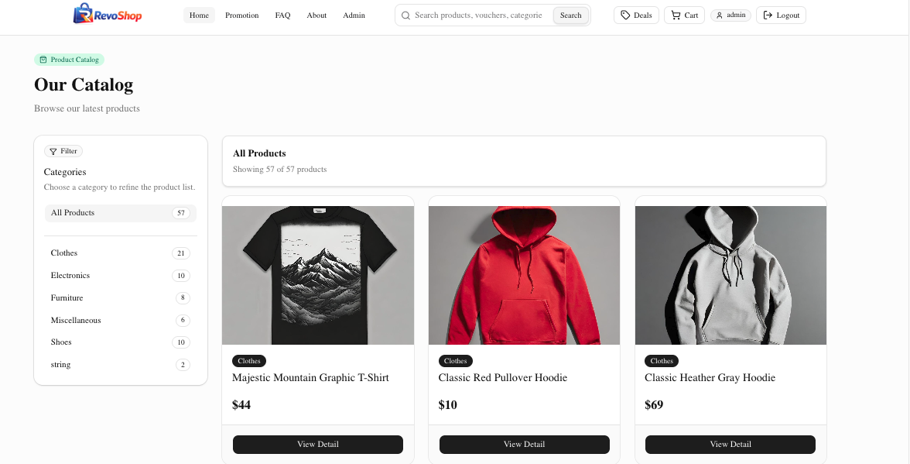
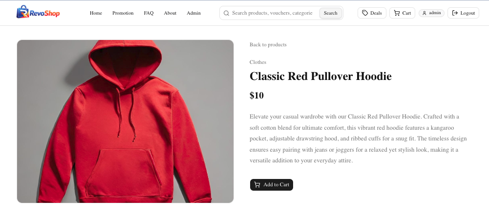
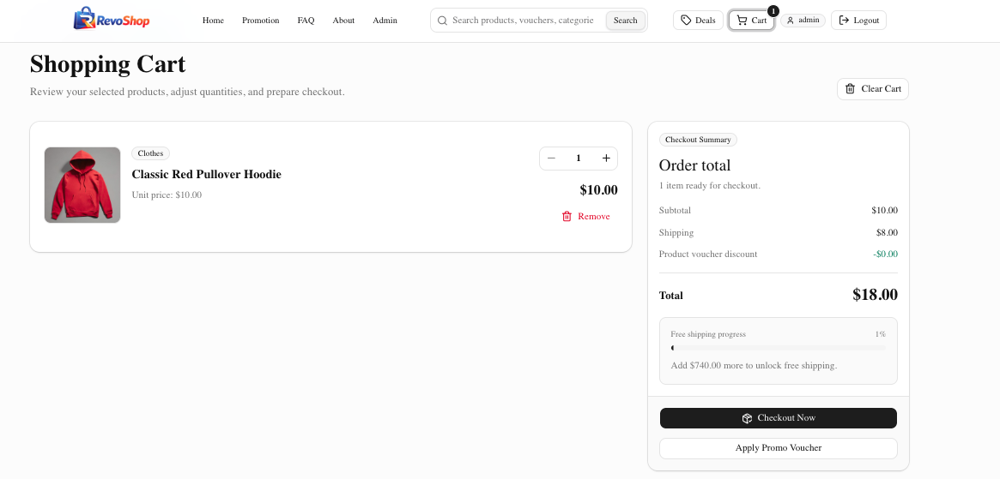
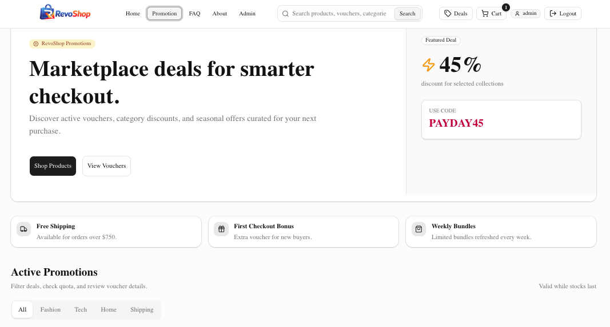
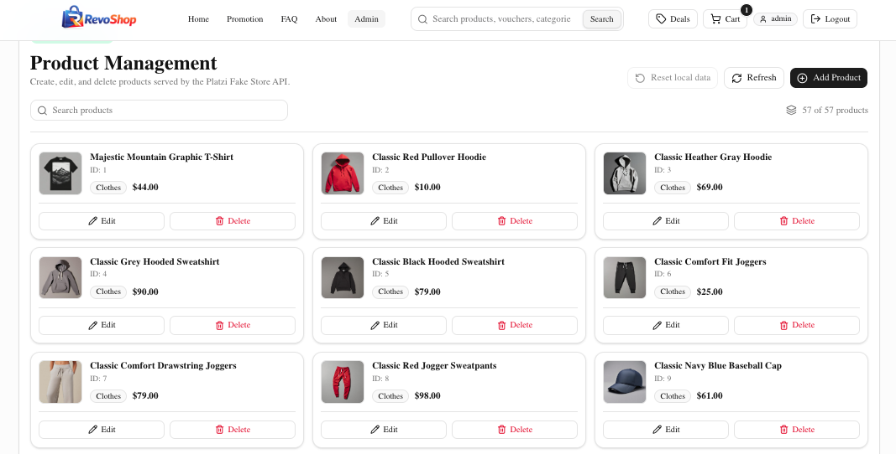

[](https://classroom.github.com/a/FR3B1BQd)

# RevoShop — Milestone 3 (Next.js E‑Commerce)

RevoShop is a Next.js e‑commerce demo built for RevoU FSSE Milestone 3.
It demonstrates the Next.js App Router, file‑based routing, dynamic routes,
client‑side navigation, component composition, and React state management
through a small but realistic shopping experience.

> Live Demo: https://revoshop.ai-novanx.online/
> Source Code: <https://github.com/Revou-FSSE-Feb26/milestone-3-AI-NovaNX>

---

## Overview

RevoShop is a single‑vendor storefront that lets an authenticated visitor
browse a product catalog, open a product detail page, add items to a cart,
claim promotion vouchers, complete checkout, and read FAQ / About content.
Product data is pulled from the
[Platzi Fake Store API](https://fakeapi.platzi.com/) and the cart state is
persisted in `localStorage` so the experience survives page reloads.

The project is intentionally implemented with reusable UI primitives
(`shadcn/ui`) and small `lib/` helpers so the codebase stays easy to read and
extend.

## Features

- **Authentication (`/login`)** — login is handled through internal API Route
  Handlers backed by the Platzi Fake Store API. The server stores the access
  token and user profile in a secure HttpOnly session cookie. A safe profile
  snapshot is also stored in `localStorage` for reactive client-side UI state.
- **Protected Routes** — `src/proxy.js` redirects unauthenticated checkout and
  admin visitors to `/login`, and restricts `/admin` to the `admin` role.
- **Product Listing (Home)** — responsive grid, category sidebar filter,
  search via the `?search=` query param, loading and empty states.
- **Product Detail (Dynamic Route)** — `/products/[id]` page with image,
  description, category, price, and Add‑to‑Cart action.
- **Cart Page** — React Context-powered quantity controls, line totals,
  free‑shipping progress, voucher application, persistent storage, and a
  checkout button.
- **Checkout Page (`/checkout`)** — protected checkout route with order items,
  shipping details, payment form, final summary, and order confirmation flow.
- **Promotions Page** — voucher catalog with category tabs, claim flow that
  writes the voucher to `localStorage` and redirects to the cart.
- **FAQ Page** — searchable, category‑tabbed accordion of frequent questions.
- **About Page** — project overview, tech stack, and portfolio highlights.
- **Sticky Navbar** — site search, navigation links, live cart badge
  (updates via a custom `cart-updated` event + the native `storage` event),
  and a mobile sheet menu.
- **Admin Dashboard (`/admin`)** — product management page for viewing,
  searching, adding, editing, and deleting products. The dashboard uses a
  localStorage override layer on top of Platzi product data so changes persist
  locally during the demo. Includes role-based access control, loading,
  validation, and success/error feedback states.
- **Auth API Routes** — `/api/auth/login`, `/api/auth/me`, and
  `/api/auth/logout` handle token login, profile validation, session lookup,
  and cookie cleanup.

## Tech Stack

| Layer         | Tools                                                                    |
| ------------- | ------------------------------------------------------------------------ |
| Framework     | Next.js 16 (App Router)                                                  |
| Language      | JavaScript (JSX) + React 19                                              |
| Styling       | Tailwind CSS v4                                                          |
| UI Primitives | shadcn/ui, Radix UI, lucide‑react icons                                  |
| Data          | Platzi Fake Store API (`api.escuelajs.co`)                               |
| Auth          | Next.js Route Handlers, Platzi Auth, HTTP-only cookies                     |
| State         | React Context, `useReducer`, `useEffect`, `useMemo` + `localStorage`     |
| Tooling       | ESLint, Bun (or npm)                                                     |

## Project Structure

```
revoshop/
├── public/                  # static assets
└── src/
    ├── app/                 # Next.js App Router pages
    │   ├── layout.js        # root layout + global Navbar
    │   ├── page.js          # Home (product listing)
    │   ├── about/page.jsx
    │   ├── admin/page.jsx           # admin product CRUD dashboard
    │   ├── api/auth/login/route.js  # login API route
    │   ├── api/auth/logout/route.js # logout API route
    │   ├── cart/page.jsx
    │   ├── checkout/page.jsx        # protected checkout page
    │   ├── faq/page.jsx
    │   ├── login/page.jsx           # localStorage-based login page
    │   ├── products/[id]/page.jsx   # dynamic product detail
    │   └── promotion/page.jsx
    ├── components/
    │   ├── Navbar.jsx
    │   ├── ProductCard.jsx
    │   ├── AddToCartButton.jsx
    │   └── ui/              # shadcn/ui primitives
    ├── context/
    │   └── CartContext.jsx  # global cart and voucher state
    ├── lib/
        ├── api.js           # Platzi product fetching + local CRUD overrides
        ├── auth.js          # auth helpers + localStorage session snapshot
        ├── cart.js          # cart storage keys + helpers
        └── utils.js         # cn(), cleanImageUrl(), formatCurrency()
    └── proxy.js             # protected-route proxy
```

## Routing & Navigation

- File‑based routing under `src/app/`.
- Login route: `src/app/login/page.jsx` submits credentials to
  `src/app/api/auth/login/route.js`.
- `/checkout` and `/admin` are protected by `src/proxy.js`. The proxy redirects
  unauthenticated visitors to `/login` and redirects non-admin users away from
  `/admin`.
- Dynamic route: `src/app/products/[id]/page.jsx` reads the `id` with
  `useParams()` from `next/navigation`.
- Client‑side navigation via `<Link>` from `next/link` in every page,
  card, and navbar entry — no full page reloads.
- The Home page reads the `?search=` query string with `useSearchParams()`
  (wrapped in `<Suspense>` to satisfy the App Router rules).
- When there is no session cookie, protected pages redirect the visitor to
  `/login`. After a successful login, the user is redirected back to Home.

## Login Accounts

This project uses the Platzi Fake Store API for user authentication. The login
Route Handler calls `POST /auth/login`, fetches the authenticated user through
`GET /auth/profile`, then stores the access token and safe user profile in an
HTTP-only cookie named `session`. `GET /api/auth/me` validates the stored token
against the Platzi profile endpoint. A safe profile snapshot is also stored in
`localStorage` under `revoshop-auth-session` for client-side role UI.

| RevoShop access | Platzi role | Normalized role |
| --------------- | ----------- | --------------- |
| Admin           | `admin`     | `admin`         |
| Customer        | `customer` or any non-admin role | `user` |

Only the normalized `admin` role can access `/admin`; all non-admin Platzi
roles are treated as `user` and redirected to the storefront.

Demo credentials verified against the Platzi API:

| Access | Email | Password |
| ------ | ----- | -------- |
| Admin | `admin@mail.com` | `admin123` |
| User | `john@mail.com` | `changeme` |

## Protected Checkout

The checkout flow is split from the cart:

| Route       | Purpose                                      | Access                         |
| ----------- | -------------------------------------------- | ------------------------------ |
| `/cart`     | Review items, quantities, vouchers, summary  | Public                         |
| `/checkout` | Enter shipping/payment details, place order  | Authenticated users only       |
| `/admin`    | Product management                           | Admin role only                |

Opening `/checkout` without a valid `session` cookie redirects to
`/login`. Completing checkout clears cart and voucher data from `localStorage`.

## Admin Dashboard

The `/admin` route provides product management with a **localStorage override
layer** on top of the Platzi Fake Store API. Because the Platzi API is a shared
sandbox, the override layer makes every change persist locally in the browser:

| Action | Trigger             | Persistence Behavior                                                        |
| ------ | ------------------- | --------------------------------------------------------------------------- |
| List   | Page load + Refresh | `GET /products` + `GET /categories`, then deletes filtered & updates merged |
| Create | "Add Product" sheet | New product stored locally with id `local-<timestamp>`, prepended to list   |
| Update | Per‑card "Edit"     | Patch saved in `localStorage`; merged on top of remote product on read      |
| Delete | Per‑card "Delete"   | Remote id added to a `deleted` set; locally created products removed        |
| Reset  | "Reset local data"  | Clears all overrides — list falls back to pure API data                     |

All overrides live under the key `revoshop:product-overrides` and follow
the shape `{ created: Product[], updated: Record<id, Patch>, deleted: number[] }`.
Categories are cached under `revoshop:categories-cache` so locally
created/updated products can resolve their category object without
re‑fetching. A `products-updated` custom event is dispatched whenever
overrides change so the dashboard summary stays live.

This layering means the dashboard behaves like a CRUD admin and the local
changes survive page reloads. Product listing and detail data are fetched from
the Platzi API through [`src/lib/api.js`](revoshop/src/lib/api.js), while
create/update/delete changes are persisted as local browser overrides for this
checkpoint.

## State Management

- `CartProvider` and `useCart()` provide global cart and voucher state to the
  Navbar, product detail, promotions, cart, and checkout pages.
- A reducer handles explicit cart actions such as `ADD_ITEM`, `REMOVE_ITEM`,
  `UPDATE_QUANTITY`, `CLEAR_CART`, voucher actions, and checkout cleanup.
- Cart actions include add, update quantity, remove, clear, apply/remove
  voucher, and clear checkout.
- The add-to-cart notification is also managed by the Context and clears
  automatically after two seconds.
- The Context persists its state in `localStorage` and listens to the native
  `storage` event to synchronize changes between browser tabs.
- `useMemo` and memoized Context actions reduce unnecessary calculations and
  avoid recreating action functions on each render.
- All cart and voucher storage keys live in [`src/lib/cart.js`](revoshop/src/lib/cart.js).

## Getting Started

Prerequisites: Node.js ≥ 20 (or Bun).

```bash
cd revoshop
npm install        # or: bun install
npm run dev        # or: bun dev
```

Open <http://localhost:3000> in your browser.

### Available Scripts

| Script          | Description                  |
| --------------- | ---------------------------- |
| `npm run dev`   | Start the Next.js dev server |
| `bun run dev`   | Start the Next.js dev server with Bun |
| `npm run build` | Production build             |
| `npm run start` | Run the production server    |
| `npm run lint`  | Lint with ESLint             |

## Deployment

This project is ready to deploy on [Vercel](https://vercel.com/). Set the
project root to `revoshop/` when importing the repository, then deploy.
The image domains used by the Platzi API are already whitelisted in
`revoshop/next.config.mjs`.

## Screenshots / Demo

### Login



### Home



### Product Detail



### Cart



### Checkout

Checkout is available at `/checkout` after login.

### Promotions



### Product Management (Admin Page)




## Acknowledgements

- [Platzi Fake Store API](https://fakeapi.platzi.com/) — product data.
- [shadcn/ui](https://ui.shadcn.com/) — accessible component primitives.
